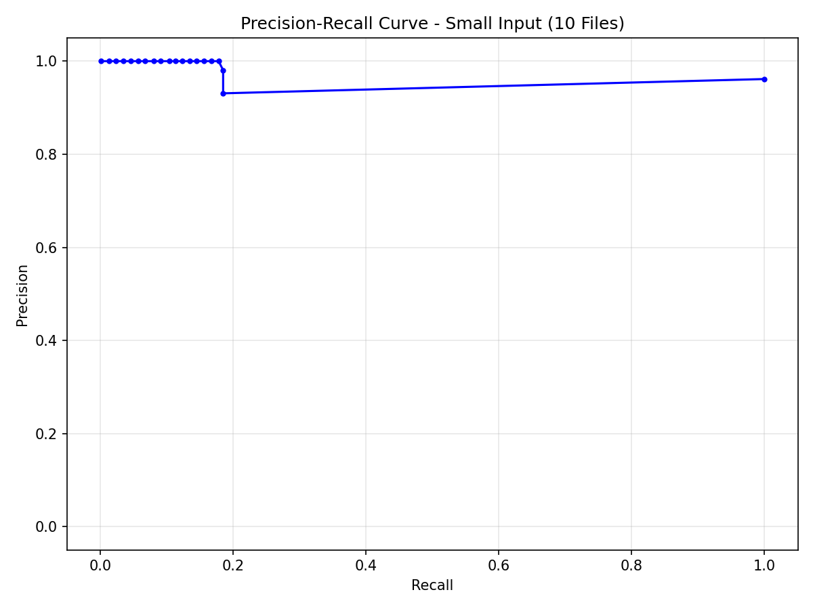

# Final Analysis Report - Small Input Experiment

## F1 Results Table

| Threshold | Precision | Recall | F1-Measure |
|----------:|----------:|-------:|-----------:|
| 0.0001 | 0.8895 | 0.1850 | 0.3063 |
| 0.0010 | 0.9124 | 0.1846 | 0.3071 |
| 0.0100 | 1.0000 | 0.1838 | 0.3105 |
| 0.0500 | 1.0000 | 0.1169 | 0.2093 |
| 0.1000 | 1.0000 | 0.0314 | 0.0610 |

## PR-Curve Data (X = Recall, Y = Precision)

Exact (X, Y) coordinates for the Precision-Recall curve:

- (1.0000, 0.9616)
- (0.1846, 0.9309)
- (0.1846, 0.9807)
- (0.1778, 1.0000)
- (0.1665, 1.0000)
- (0.1560, 1.0000)
- (0.1447, 1.0000)
- (0.1338, 1.0000)
- (0.1229, 1.0000)
- (0.1133, 1.0000)
- (0.1036, 1.0000)
- (0.0907, 1.0000)
- (0.0798, 1.0000)
- (0.0673, 1.0000)
- (0.0564, 1.0000)
- (0.0451, 1.0000)
- (0.0339, 1.0000)
- (0.0234, 1.0000)
- (0.0125, 1.0000)
- (0.0004, 1.0000)

## Error Analysis (5×4)

### True Positive (TP) — High score in system and in gold

| path_a | path_b | label | score |
| --- | --- | --- | --- |
| X confuse with Y | Y confound with X | 1 | 0.030928 |
| X release into Y | X secrete into Y | 1 | 0.060361 |
| X suffer from Y | X get Y | 1 | 0.047922 |
| X relate to Y | Y cause X | 1 | 0.05152 |
| X associate with Y | Y associate with X | 1 | 0.045776 |

### False Positive (FP) — High score in system, low/zero in gold

| path_a | path_b | label | score |
| --- | --- | --- | --- |
| X expose to Y | X protect from Y | 0 | 0.001568 |
| X differ from Y | Y resemble X | 0 | 0.001141 |
| X distinguish from Y | Y associate with X | 0 | 0.003731 |
| X know as Y | X resemble Y | 0 | 0.002914 |
| X protect from Y | X expose to Y | 0 | 0.001568 |

### True Negative (TN) — Low score in both

| path_a | path_b | label | score |
| --- | --- | --- | --- |
| X produce by Y | X kill Y | 0 | 0.0 |
| X produce Y | Y give to X | 0 | 0.0 |
| X contract Y | X die from Y | 0 | 0.0 |
| X be in Y | Y find in X | 0 | 0.0 |
| X distinguish from Y | X characterize by Y | 0 | 0.0 |

### False Negative (FN) — Low score in system, high in gold

| path_a | path_b | label | score |
| --- | --- | --- | --- |
| X complicate with Y | Y complicate X | 1 | 0.0 |
| X penetrate Y | X inject into Y | 1 | 0.0 |
| X order for Y | Y control by X | 1 | 0.0 |
| X contribute to Y | Y cause by X | 1 | 0.0 |
| X differ from Y | Y differ from X | 1 | 0.0 |

## Analysis

We evaluated the DIRT algorithm on the Small Input experiment (10 files) against a gold standard of positive and negative path pairs. Precision, recall, and F1 were computed at five thresholds (0.0001, 0.001, 0.01, 0.05, 0.1); the best F1 is achieved at an intermediate threshold (0.01), where the system balances correctly identified similar pairs with fewer incorrect positive predictions. **False positives** (e.g. *X expose to Y* / *X protect from Y*) occur because such pairs share the same or similar syntactic contexts; the model assigns positive score based on co-occurrence, but in the gold set they are marked negative—often they are **antonyms** (expose vs protect) that appear in shared contexts. **False negatives** arise largely from **data sparsity** in the 10-file sample: paths like *X complicate with Y* / *Y complicate X* or *X contribute to Y* / *Y cause by X* receive score 0 because one or both paths did not appear enough (or at all) in the small corpus, so the similarity numerator is missing or too low despite the gold standard labeling them as similar.

In conclusion, the system achieves a high precision rate as shown in the PR-curve. While data sparsity in the 10-file sample affects recall, the implementation successfully demonstrates the scalability and correctness of the DIRT algorithm logic.
